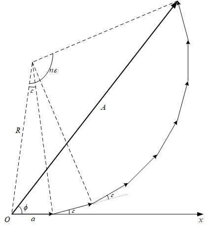

---	
layout:     post	
title:      『Physics』 Vibration	
subtitle:   『物理学』 振动    
date:       2020-12-30	   
author:     Coekjan 
header-img: img/post-bg-PHY.jpg	
catalog:    true	
mathjax:    true    
tags:	
    - Physics  
---

## 谐振动

### 谐振动的特征与表达式

考虑一个质量为 $m$ 的物体系于一端固定的轻弹簧(弹簧的质量相对于物体质量而言可以忽略不计)的自由端, 弹簧和物体组成的系统称作**弹簧振子**. 物体所受合外力为零的位置称作**平衡位置**.

若把物体在弹簧的方向上稍加移动, 偏移平衡位置后释放, 则物体会在平衡位置附近作往复运动. 下面研究这样的往复运动有何特征.

取物体的平衡位置为坐标原点 $O$ , 取物体运动轨迹所在直线为 $Ox$ 轴, 向右为正方向. 按胡克定律, 在弹簧的弹性限度内, 物体所受的拉力 $F$ 与物体相对于平衡位置的位移 $x$ 成正比关系:

$$
F=-kx
$$

比例系数 $k$ 称作弹簧的劲度系数. 根据牛顿第二定律, 物体的加速度:

$$
\begin{aligned}
    &\frac{\operatorname{d}^2x}{\operatorname{d}t^2}=-\frac{k}{m}x\xlongequal{\omega^2:=k/m}-\omega^2x\\
    \Leftrightarrow&\frac{\operatorname{d}^2x}{\operatorname{d}t^2}+\omega^2x=0
\end{aligned}
$$

求解此微分方程, 可得:

$$
x=A\cos(\omega t+\phi_0)
$$

其中 $A$ 与 $\phi_0$ 均为积分常量. 我们称满足这样关系的运动称作**谐振动**.

有时我们会使用其复指数形式:

$$
x=Ae^{i(\omega t+\phi_0)}
$$

通过谐振动的 $x-t$ 方程, 还可得到 $v-t$ 和 $a-t$ 方程:

$$
v=-v_m\sin(\omega t+\phi_0)
$$

$$
a=-a_m\cos(\omega t+\phi_0)
$$

其中 $v_m=\omega A$ , $a_m=\omega^2A$ 称作速度峰值, 加速度峰值.

若给定初始条件:

$$
\left\{\begin{aligned}
    x_0&=A\cos\phi_0\\
    v_0&=-\omega A\sin\phi_0
\end{aligned}\right.
$$

可以得到积分变量的值:

$$
\left\{\begin{aligned}
    A&=\sqrt{x_0^2+\frac{v_0^2}{\omega^2}}\\
    \phi_0&=\arctan\left(-\frac{v_0}{\omega x_0}\right)
\end{aligned}\right.
$$

### 谐振动的特征量

1. 振幅 $A$ : 作谐振动的物体离开平衡位置的最大位移的绝对值.
2. 周期 $T$ : 完成一次完整振动所经历的时间.
3. 频率 $\nu$ : 单位时间内物体所作的完全振动的次数, 也称圆频率.
4. 相位 $\phi$ : 振动物体在某一时刻 $t$ 时具有相位 $\omega t +\phi_0$ ; $t=0$ 时具有的相位称为**初相**.

易见, 角速度 $\omega$ , 周期 $T$ , 频率 $\nu$ 间有以下关系:

$$
\begin{aligned}
    T&=\frac{2\pi}{\omega}\\
    \nu&=\frac{1}{T}\\
    \omega&=2\pi\nu
\end{aligned}
$$

### 常见的谐振动

#### 单摆

一根长度为 $l$ 的不伸缩细线, 上端固定(或一根刚性轻杆, 上端与无摩擦的铰链相连), 下端悬一小重物 $m$ , 把重物略加移动后就可以在竖直平面内来回摆动, 称这种装置为**单摆**.

当摆线与竖直方向成 $\theta$ 角时, 重物受到重力 $G$ 与拉力 $F$ 两个不共线的力作用. 重力的切向分量为 $mg\sin\theta$ , 此即为重物受到的合外力.

考虑角位移 $\theta$ 从竖直位置算起, 并规定逆时针方向为正, 则重物有角加速度: $\beta=\displaystyle\frac{\operatorname{d}^2\theta}{\operatorname{d}t^2}$ , 因此重物的切向加速度为: $a_t=l\displaystyle\frac{\operatorname{d}^2\theta}{\operatorname{d}t^2}$ , 由牛顿第二定律:

$$
-mg\sin\theta=ml\frac{\operatorname{d}^2\theta}{\operatorname{d}t^2}
$$

当 $\theta$ 很小时, $\sin\theta\approx\theta$ , 因此:

$$
\frac{\operatorname{d}^2\theta}{\operatorname{d}t^2}=-\frac{g}{l}\theta\xlongequal{\omega^2:=g/l}-\omega^2\theta
$$

可见这是谐振动, 振动表达式为:

$$
\theta=\theta_m\cos(\omega t + \phi_0)
$$

振动周期为:

$$
T=\frac{2\pi}{\omega}=2\pi\sqrt{\frac{l}{g}}
$$

理论上, $\theta_m=15^\circ$ 时, 真实周期与上述计算结果相差不超过 $0.5\%$

#### 复摆

称一个可绕定轴 $O$ 摆动的刚体为**复摆**, 也称**物理摆**.

平衡时, 摆的重心 $C$ 在距离轴的正下方 $h$ 处; 摆动时, 重心与轴的连线 $OC$ 偏离平衡位置. 设某一时刻 $t$ , $OC$ 与竖直位置夹角为 $\theta$ , 规定逆时针方向的角位移为正.

此时复摆受到对于轴 $O$ 的力矩为:

$$
M=-mgh\sin\theta
$$

刚体绕 $O$ 的转动惯量若为 $J$ , 根据转动定律:

$$
J\frac{\operatorname{d}^2\theta}{\operatorname{d}t^2}=-mgh\sin\theta
$$

当 $\theta$ 很小时, $\sin\theta\approx\theta$ , 因此:

$$
\frac{\operatorname{d}^2\theta}{\operatorname{d}t^2}=-\frac{mgh}{J}\theta\xlongequal{\omega^2:=mgh/J}-\omega^2\theta
$$

可见这是谐振动, 振动表达式为:

$$
\theta=\theta_m\cos(\omega t + \phi_0)
$$

振动周期为:

$$
T=\frac{2\pi}{\omega}=2\pi\sqrt{\frac{J}{mgh}}
$$

### 谐振动的能量

现以弹簧振子为例研究谐振动的能量.

谐振动的动能:

$$
E_k=\frac{1}{2}mv^2=\frac{1}{2}m\omega^2A^2\sin^2(\omega t+\phi_0)
$$

谐振动的势能:

$$
E_p=\frac{1}{2}kx^2=\frac{1}{2}kA^2\cos^2(\omega t+\phi_0)
$$

考虑到 $\omega^2=\displaystyle\frac{k}{m}$ , 则总能量:

$$
E=E_k+E_p=\frac{1}{2}kA^2
$$

计算式 $E=\displaystyle\frac{1}{2}kA^2$ 适用于任意谐振动.

另外, 根据三角函数的半角公式, 不难证明**动能, 势能的变化频率是振子频率的两倍**.

## 谐振动的合成

### 一维谐振动的合成

#### 同一直线上两个同频率的谐振动合成

考虑两个谐振动:

$$
\begin{aligned}
    x_1&=A_1\cos(\omega t+\phi_{01})\\
    x_2&=A_2\cos(\omega t+\phi_{02})
\end{aligned}
$$

一个质点若同时参与这两个谐振动, 则有合位移:

$$
\begin{aligned}
    x=&x_1+x_2=A_1\cos(\omega t+\phi_{01})+A_2\cos(\omega t+\phi_{02})\\
    =&A_1\cos\phi_{01}\cos\omega t-A_1\sin\phi_{01}\sin\omega t+A_2\cos\phi_{02}\cos\omega t-A_2\sin\phi_{02}\sin\omega t\\
    =&(A_1\cos\phi_{01}+A_2\cos\phi_{02})\cos\omega t-(A_1\sin\phi_{01}+A_2\sin\phi_{02})\sin\omega t
\end{aligned}
$$

通过三角函数的辅助角公式, 得到化简结果为:

$$
x=A\cos(\omega t+\phi_0)
$$

其中:

$$
A=\sqrt{A_1^2+A_2^2+2A_1A_2\cos(\phi_{01}-\phi_{02})}
$$

$$
\phi_0=\arctan\frac{A_1\sin\phi_{01}+A_2\sin\phi_{02}}{A_1\cos\phi_{01}+A_2\cos\phi_{02}}
$$

可以轻松得到一些结论:

1. 若两振动同相 $\phi_{01}=\phi_{02}+2k\pi\:(k=0,\pm1,\pm2,\dotsm)$ , 则合振动的振幅为 $A=A_1+A_2$ ;
2. 若两振动反相 $\phi_{01}=\phi_{02}+(2k+1)\pi\:(k=0,\pm1,\pm2,\dotsm)$ , 则合振动的振幅为 $A=\vert A_1-A_2\vert$
3. 若两振动既不同相也不反相, 则合振动的振幅在区间 $(\vert A_1-A_2\vert,A_1+A_2)$ 内.

##### 同一直线上的 $N$ 个同频率同振幅谐振动合成

若有一系列谐振动:

$$
\left\{\begin{aligned}
    x_1&=a\cos\omega t\\
    x_2&=a\cos(\omega t+\varepsilon)\\
    x_3&=a\cos(\omega t+2\varepsilon)\\
    &\vdots\\
    x_N&=a\cos\left[\omega t+(N-1)\varepsilon\right]
\end{aligned}\right.
$$

此时, 考虑使用旋转矢量法计算:

合振动方程形式应为:

$$
x=A\cos(\omega t + \phi)
$$

可以通过上图解得:

$$
\left\{\begin{aligned}
    A&=a\frac{\displaystyle\sin\frac{N\varepsilon}{2}}{\displaystyle\sin\frac{\varepsilon}{2}}\\
    \phi&=\frac{N-1}{2}\varepsilon
\end{aligned}\right.
$$

因此合振动方程表达式:

$$
x=a\frac{\displaystyle\sin\frac{N\varepsilon}{2}}{\displaystyle\sin\frac{\varepsilon}{2}}\cos\left(\omega t+\frac{N-1}{2}\varepsilon\right)
$$

#### 同一直线上两个不同频率的谐振动合成

0